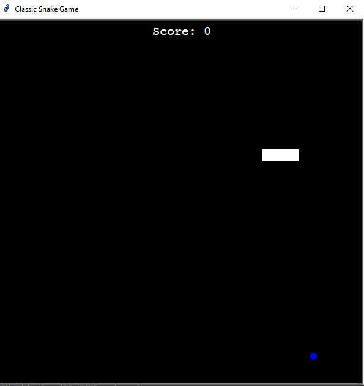
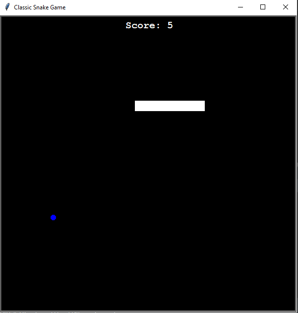
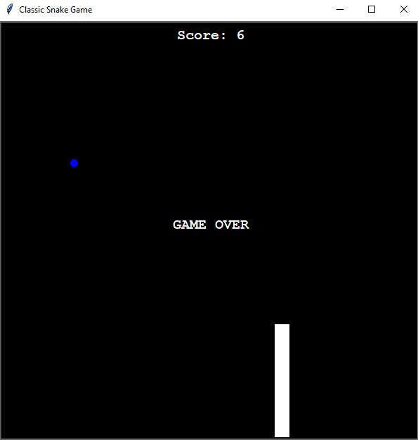

# A Classic Snake Game Using Python

Created the classic mobile snake game using Python

### `GamePlay`  

 Use Arrow Keys to control the movement of the snake.
Consume food to grow the snake and earn points. Game will
end if the snake clashes with the boundary or with
itself. 

## Screenshots

